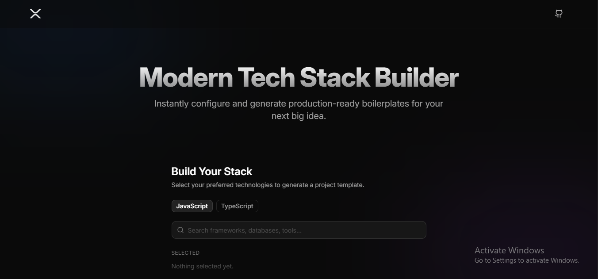

<div align="center">
  
  <h1>setup-x</h1>
  <p><strong>Modern Tech Stack Builder</strong></p>
</div>



`setup-x` is a premium, command-palette-style web application designed to help developers instantly configure and generate production-ready setup commands for their next project.

## ✨ Features

- **Instant Search**: Quickly find frameworks, databases, and tools using a high-performance fuzzy search (Fuse.js).
- **3-Step Setup Guide**:
  1. **Initialize Project**: Core project creation commands.
  2. **Install Dependencies**: Aggregated `npm` installation commands for the entire stack.
  3. **Configuration & Setup**: Detailed file-specific instructions and manual setup notes.
- **Premium UI/UX**: Built with React, Tailwind CSS, and Shadcn UI, featuring a sleek dark mode, glassmorphism, and smooth micro-animations.
- **Copy to Clipboard**: One-click copying for individual steps or the entire script.
- **Smart Filtering**: Ensures technology compatibility (e.g., prompts for Vite-only frameworks when Vite is selected).
- **Language Toggle**: Seamlessly switch between JavaScript and TypeScript templates.

## 🚀 Tech Stack

- **Core**: [React 18](https://react.dev/)
- **Bundler**: [Vite](https://vitejs.dev/)
- **Styling**: [Tailwind CSS](https://tailwindcss.com/)
- **Components**: [Shadcn UI](https://ui.shadcn.com/)
- **Icons**: [Lucide React](https://lucide.dev/)
- **Search Engine**: [Fuse.js](https://www.fusejs.io/)

## 🛠️ Getting Started

### Prerequisites

- Node.js (v18 or higher)
- npm or pnpm

### Installation

1. Clone the repository:
   ```bash
   git clone https://github.com/MS-Builds/setup-x.git
   cd setup-x
   ```

2. Install dependencies:
   ```bash
   npm install
   ```

3. Start the development server:
   ```bash
   npm run dev
   ```

## 📖 How to Use

1. **Pick your language**: Toggle between JS and TS at the top.
2. **Search & Add**: Use the search bar to find and select your desired tech (Framework, Database, Styling, etc.).
3. **Review Stack**: Your selected items appear in the "Selected Stack" section.
4. **Follow Steps**: The app automatically generates a step-by-step setup guide below.
5. **Copy & Run**: Use the "Copy" buttons to run the commands in your terminal.

## 📄 License

Distributed under the MIT License. See `LICENSE` for more information.

---

Built with ❤️ by the setup-x team.
